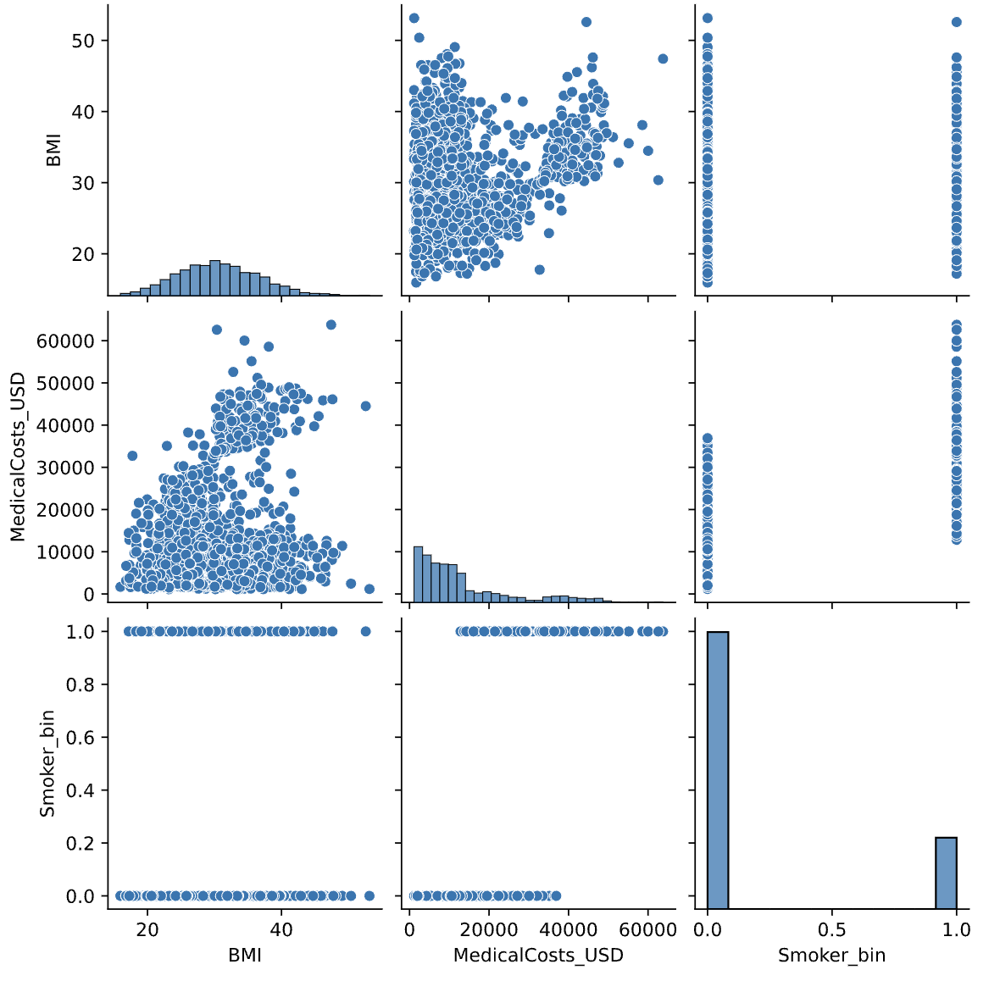
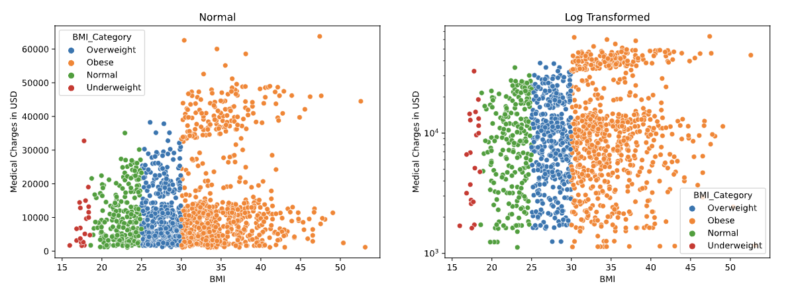

# Analysis of Medical Cost , to predict insurance prices 

## [Click this Final Analysis File](https://github.com/arshappleid/Health_Data_Statistics/blob/main/DataAnalysis.h)

## Milestones

Final Analysis for Milestone 2 can be found [here](https://github.com/data301-2021-summer2/group29-project/blob/main/analysis/Analysis_task4.md).
Individual EDA's for Milestone 2 can be found [here](https://github.com/data301-2021-summer2/group29-project/blob/main/analysis/Ishita%20Gupta/Milestone2.ipynb) and [here](https://github.com/data301-2021-summer2/group29-project/blob/main/analysis/Prabhmeet%20Deol/DataAnalysis.ipynb).

Dashboard for Milestone 4 can be found [here](https://github.com/data301-2021-summer2/group29-project/blob/main/presentation/FinalDashboard.twbx).

- [Link](https://www.youtube.com/watch?v=VIeNYzg3JXM) to the presentation video for the dashboard.

## Topic/interest in about 150-200 words

This is a medical cost dataset of individuals in the United States as billed by various health insurance companies. Through this project, we wish to study the effect of the independent variables on the medical costs incurred by insurance service providers as well as the interplay between these seemingly distinct variables.
Some questions that we are particularly interested in exploring are:

- Does having a high BMI result in incurring more medical charges in the United States? _Edit_: Later during the EDA it was found that the sample might be biased towards one Bmi category , thus a random sample had to be taken , for a better analysis.
- Do geographical regions play a part in increased medical costs? _Edit_: After performing my EDA, I was also interested in assessing the relationship between a person who smokes and their medical cost. Would a smoker incur higher medical costs?

A useful outcome of this project could be to explore the results of controllable variables in reducing the total medical costs. For instance, not smoking and reducing one’s BMI may reduce the annual medical costs. In today’s world, the medical costs are quite high so any action we could take to reduce them would be incredibly helpful.
I believe we could try to make a user-facing dashboard since they make it easier for users to read and understand the data.

## Dataset in about 150-200 words

- It is being assumed that the reported charges are annual charges, since it was not reported that the charges were incurred over lifetime, and the charges seem justifiable for each year .

Tha dataset provides the annual medical expenses of several individuals relying on US based insurance companies to pay for their medical expenses in the US. Furthermore, the individuals are also categorized based of their residential area in the US, as well as gender, BMI, children covered under same and, and even if they are categorized as smokers or non-smokers. Also, the individuals age has been recorded as an ordinal data type. The dataset consists of about 1339 enteries, with all of the enteries or variables reported for each individual. Additionally, it seems that the dataset contains similar number of enteries for all age groups reported, and also that the male to female ratio is 51:49 in the dataset, which is pretty accurate in representing the normal population of the US. It was also made sure that almost equal number of measurements were taken from all the four categorized regions of US. This helps to ensure that the data is not biased of any certain categorial variable. Thus, it is possible for us to conduct test to prove if any certain categorial variables show signs of having high medical expenses.

There was no information found on which company collected the dataset , although it was found that the dataset was created/uploaded on an [online source](https://www.kaggle.com/mirichoi0218/insurance/home) 3 years ago. The dataset was made public for possible educational purposes, and has been registered under [Open Data Commons](https://opendatacommons.org/licenses/dbcl/1-0/). Moreover, no information was found regarding whether the data was collected by a machine or a person.

### Visuals Made :

## References

- https://www.kaggle.com/mirichoi0218/insurance/home (accessed July 14, 2021)

- https://www.geeksforgeeks.org/python-random-sample-function/ (accessed Aug 4, 2021)

- https://help.tableau.com/current/pro/desktop/en-us/buildexamples_boxplot.htm (accessed Aug 11, 2021)

- https://www.youtube.com/watch?v=Wag4j3YFhMc (accessed Aug 11, 2021)
